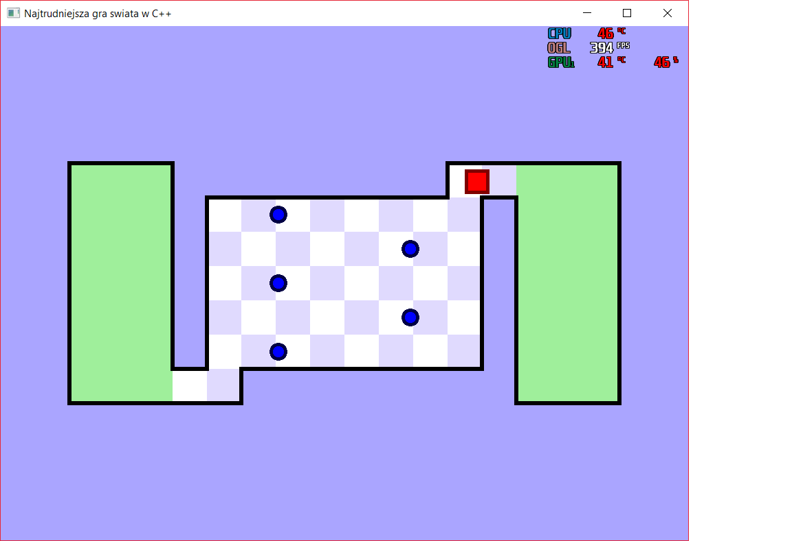
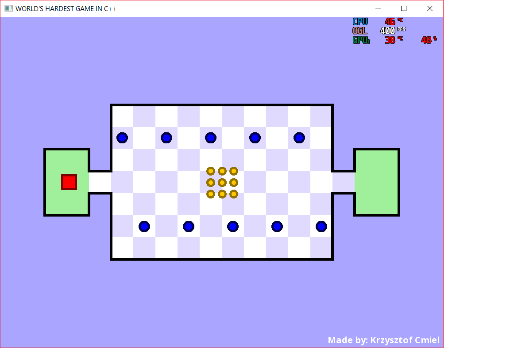

# Worlds-Hardest-Game-Cpp
#### Recreation of the "World's hardest game" in C ++ as part of a university project.
##### Implementation: Krzysztof Ćmiel

### Założenia projektu:
- minimum 2 poziomy
- poziomy mogą się różnić, lecz nie będą łatwiejsze niż w oryginalnej grze
- pieniążki do zebrania (warunek ukończenia poziomu)
- poprawnie działająca kolizja (problem chwytania za rogi)
- GOD MODE

### Screen shots from game:

 
# Najtrudniejsza gra na świecie

**Implementacja dwóch poziomów w języku C++.**

**Instrukcja:**

- Użyj klawiszy **W,A,S,D** lub **strzałek** , aby doprowadzić czerwony kwadrat do strefy końcowej przez labirynt kulek. To wcale nie takie proste! Po drodze musisz zebrać wszystkie złote monety, aby strefa końcowa przeniosła Twój kwadrat na następny poziom. Po drodze powinieneś unikać niebieskich kulek, w przeciwnym razie - wrócisz do strefy początkowej danego poziomu.
**Powodzenia! Z pewnością Ci się przyda.**

**Gatunek gry:** zręcznościowa

**Platforma:** Windows

**Cechy rozgrywki:** trudna, wciągająca, wymagająca skupienia

**Liczba poziomów:** 2 (planowane rozwijanie projektu )

**Długość rozgrywki:** [1min - **∞**] (zależy od poziomu zaawansowania gracza)

**Wymagania:** pakiet biblioteki [SFML 2.5.1](https://www.sfml-dev.org/download/sfml/2.5.1/), system operacyjny Windows wraz ze wsparciem dla kompilacji języka C++.

**Struktura projektu:**

## **main.cpp**

-
  -  **int main()**
##### Główna funkcja globalna, zawiera trzy pętle odpowiadające za prawidłowe działanie dwóch poziomów oraz ekranu końcowego.

-
  -  **bool isIntersecting(T1&amp; AA, T2 BB)**
##### Funkcja przyjmująca jako parametry dwa obiekty różnych klas. Sprawdza czy nie zachodzi pomiędzy nimi kolizja, a następnie zwraca false, w przeciwnym wypadku zwraca wartość true. Funkcja została również przeciążona dla obiektów klas Square oraz Line z powodu odrębnego przypadku kolizji.

-
  -  **void collisionTest(Square&amp; square, Coin&amp; coin)**
##### Jeśli zachodzi kolizja między obiektem klasy Square a obiektem klasy Coin, nadaje temu drugiemu status zebranego.

-
  -  **bool endLvl(Spot&amp; spot)**
##### Obsługuje wizualizacje zakończenia danego poziomu, zwraca wartość true kiedy spot końcowy zakończy animację.

## **Square**
#### **Klasa odpowiadająca za głównego bohatera gdy – czerwony kwadrat.**

-
  -  **void update();**
  -  **void setPossition(Vector2f vector);**

##### **Metody odpowiadające za ruch obiektu:**

-
  -  **void stepUp(bool x);**
  -  **void stepDown(bool x);**
  -  **void stepRight(bool x);**
  -  **void stepLeft(bool x);**

##### **Metody zwracające pozycje poszczególnych krawędzi obiektu:**

-
  -  **float top();**
  -  **float bottom();**
  -  **float right();**
  -  **float left();**

##### **Metody obsługujące zjawisko zamrożenia bohatera po kolizji z botem(niebieska kulka):**

-
  - **void setFrozen(bool x);**
  - **bool getFrozen();**
  - **bool comeBack();**
## **Line**

#### **Klasa reprezentuje obiekty skrajnych linii na planszy.**

-
  - **float top();**
  - **float bottom();**
  - **float right();**
  - **float left();**

## **Bot**

#### **Klasa odpowiada za niebieskie kule, które są wrogami głównego bohatera gry.**

-
  - **void update();**
  - **void setFrozen(bool x);**

-
  - **float top();**
  - **float bottom();**
  - ***float right();**
  - **float left();**

-
  - **float deviation();**
## **Coin**

#### **Klasa reprezentująca monety,  konieczne do ukończenia poziomu.**

-
  - **void update();**
  - **void setCollected(bool x);**

-
  - **float top();**
  - **float bottom();**
  - **float right();**
  - **float left();**

-
  - **bool isCollected();**
## **Spot**

#### **Klasa odpowiada za obiekty realizujące spoty na danym poziomie.**

-
  - **float top();**
  - **float bottom();**
  - **float right();**
  - **float left();**

-
  - **bool tap();**
